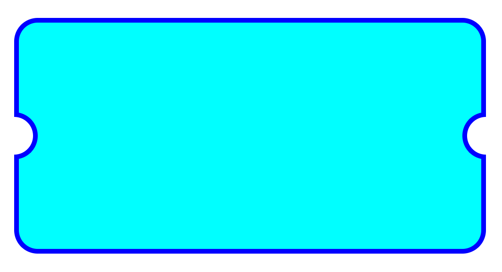

# here goes some fun html sass dynamic calculated designs :D

**Selector:** on each section there is a selector section and shows which part of index.html that demo is refering to

**Parameters:** first shows line of variable definition, second id explanation of each section, third is it's current value

**Files location:** there is a scss file on scss folder for each selector mentioned on readme file
E.g. Number 1: the selector is #card1, so there is file ./scss/card1.css and you can see the code

## 1- semi-cicle-on-border on a box

### Selector: #card1

### Parameters:

--wrapper-background: 3, background color of box wrapper, #fff
--box-background: 11, background color of box, aqua
--box-border-color: 12, color of bod, blue
--box-border-width: 13, width of the box border, 2px
--radius-to-border-scale: 14, scale wich changes semi-cicle size based on border width, the bigger it is the cicle will be bigger in comparasion to the border with, 5
--semi-circle-radius: 15, it's just the multiplication of --box-border-width and --radius-to-border-scale, 10px
