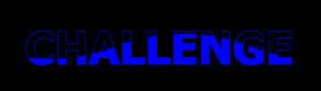
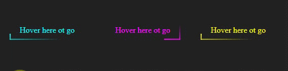

# some fun html sass dynamic calculated designs :D

**Selector:** on each section there is a selector section and shows which part of index.html that demo is refering to

**Parameters:** first shows line of variable definition, second id explanation of each section, third is it's current value

**Files location:** there is a scss file on scss folder for each selector mentioned on readme file  
E.g. Number 1: the selector is #card1, so there is file ./scss/card1.css and you can see the code

## 1- semi-cicle-on-border on a box

### Selector: #card1

### Parameters:

--wrapper-background: 3, background color of box wrapper, #fff  
--box-background: 4, background color of box, aqua  
--box-border-color: 5, color of border, blue  
--box-border-width: 6, width of the box border, 2px  
--scale-radius-to-border: 7, scale which changes semi-cicle size based on border width, the bigger it is the cicle will be bigger in comparasion to the border with, 5  
--scale-cicle-radius-to-box-radius: 8, scale which changes box border-radius according to semi-cicle-radius(1 for same size), 1
--semi-circle-radius: 9, it's just the multiplication of --box-border-width and --radius-to-border-scale, 10px
--semi-circle-radius: 9, it's just the multiplication of --scale-cicle-radius-to-box-radius and --semi-circle-radius, 5px

## 2- wavy colored text

### Selector: #wave1

### Parameters:

--color-1: 2, background and text color 1, #000  
--color-1: 3, text stroke and text color 2, blue  
--wave-speed: 4, time it takes wave one full cicle, 3s  

## 3- ciculating border on link

### Selector: #button1

### Parameters:

--section-bg-color: 2, section background color: #222  
--box-color: 27, color of button, #ff0  
--base-time: 28, one fourth of time you want a cicle take, .4s
